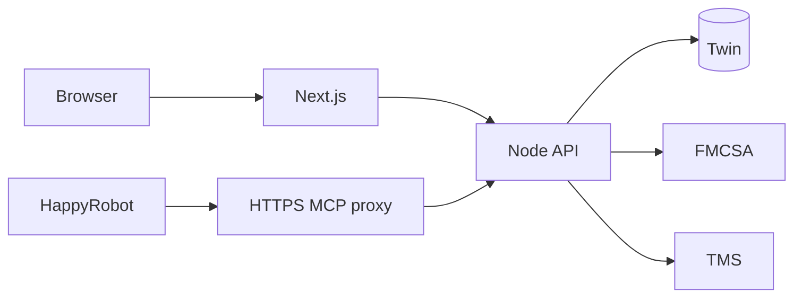

# Carrier sales POC

A local carrier-sales voice application built with Next.js, a Node API, Twin
persistence, live FMCSA/TMS reads, HappyRobot MCP tools, and an operator
dashboard.

This is a development demo. The voice flow uses screen-only OTP delivery,
booking is simulated by default, manager approval uses a local adapter, and no outbound callback or
notification is sent.

## Quick start

Prerequisites: Node 22, Docker Desktop, access to the configured Twin, FMCSA,
TMS, HappyRobot, and ngrok services.

Create the ignored environment files and fill in the existing service
credentials:

~~~sh
cp .env.example .env.local
cp .env.docker.example .env.docker.local
# Optional: cp .env.eval.example .env.eval.local
npm ci
~~~

Start the complete local demo:

~~~sh
npm run local:up
~~~

Open http://localhost:3000. Stop the stack with:

~~~sh
npm run local:down
~~~

The stack runs the web app on port 3000, the API on port 3001, an authenticated
MCP proxy, and a stable ngrok tunnel. Startup checks the saved HappyRobot
development connection and its tool wiring.

The normal stack reads only `.env.local` and `.env.docker.local`. Native
adversarial and negotiation controllers additionally read `.env.eval.local`;
email OTP settings belong in the optional `.env.email.local` overlay.

For application-only development, use:

~~~sh
npm run dev
~~~

This starts the web app and API without the Docker MCP proxy and tunnel.

## Product flow

1. The caller provides an MC number and the API verifies operating authority
   through FMCSA.
2. The agent requests an OTP. The local authenticated page displays the
   screen-only demo code; the caller reads it to the agent.
3. After verification, the agent searches real TMS inventory. A city alone is
   enough to start a search.
4. The caller selects a load, then accepts, rejects, or counters the returned
   offer. Pricing ceilings remain server-side and counters are limited per call.
5. An agreed load can enter the simulated booking flow. Pending loads can
   instead create a consented callback review.
6. The call is finalized and unresolved follow-up appears in the operator queue.

## Architecture

- apps/web contains the interface and same-origin API proxy.
- apps/api owns business decisions, integrations, MCP dispatch, and persistence.
- packages/contracts contains browser-safe shared schemas.
- apps/api/src/db contains the Drizzle schema and persistence.
- apps/api/db contains the fresh baseline and disposable database checks.
- scripts/happyrobot contains workflow configuration and native test controllers.

See [architecture](docs/architecture.md) for component ownership, call and booking
flows, the data model, trust boundaries, and persistence guarantees.

## Checks

~~~sh
npm test
npm run typecheck
npm run build
npm run check:boundaries
npm run db:check
npm run db:test
~~~

With the local stack running:

~~~sh
npm run local:check
npm run verify:local
npm run verify:mcp
~~~

These checks do not replace a spoken microphone/audio acceptance call.

## Documentation

- [Architecture](docs/architecture.md) — how components, state and integrations work
- [Testing strategy](docs/tests.md) — Northstars, scenario coverage and backend-session controllers
- [Local Docker setup](docs/local-docker.md)
- [HappyRobot agent runbook](docs/happyrobot-agent-runbook.md)
- [Operator dashboard](docs/operations.md)

Keep credentials in ignored environment files. The browser never receives
integration keys, OTP signing secrets, private pricing, or raw Twin records.
The authenticated local demo page deliberately displays the caller’s OTP digits.
