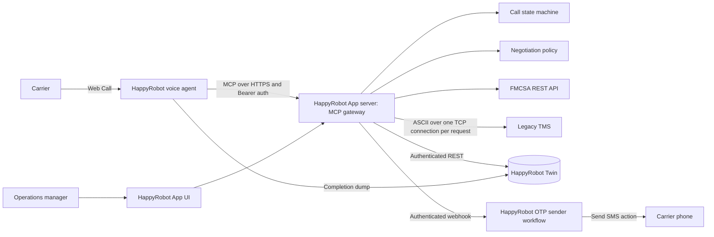
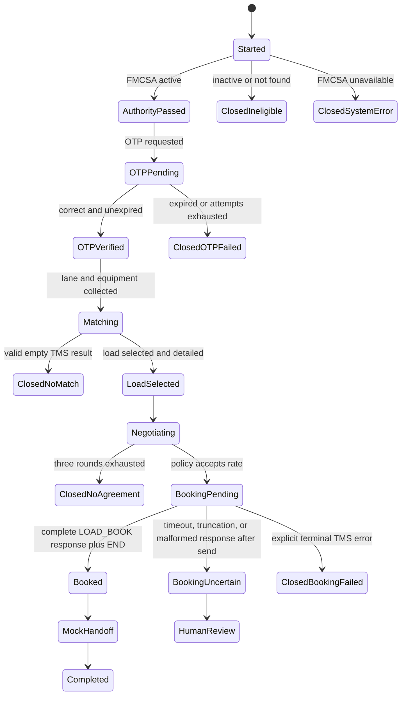

# Inbound Carrier Sales POC - Architecture Plan

## 1. The system in plain language

- **HappyRobot voice agent** is the salesperson. It talks to the carrier and asks one question at a time.
- **Our MCP gateway** is the rule enforcer and translator. For the POC, it can live in the HappyRobot App's Next.js server routes rather than in a separately deployed service. The agent cannot verify itself, skip OTP, decide a rate ceiling, or claim a booking without this code.
- **FMCSA** answers whether the carrier has active operating authority.
- **OTP workflow** proves that the caller controls the supplied contact channel before any load is discussed.
- **Legacy TMS** is the source of truth for available loads and bookings. It speaks a fragile TCP protocol, not HTTP or JSON.
- **Twin** is the audit notebook. It records every call state, tool event, verification, negotiation, booking attempt, and final outcome.
- **HappyRobot App** is the manager's control screen. It reads approved operational views from Twin and highlights exceptions.

The most important boundary is this: the language model manages the conversation, while deterministic code manages compliance, money, mutations, and audit state.

## 2. Proposed architecture



### Runtime components

| Component | Responsibility | Must never do |
| --- | --- | --- |
| Voice workflow | Web Call, natural conversation, collect inputs, invoke tools, mock handoff | Decide authority, OTP success, allowed price, or booking success |
| HappyRobot App server / MCP gateway | Authenticate tools, enforce state, normalize input, call TCP/REST dependencies, return safe results | Expose secrets or private rate fields |
| FMCSA adapter | Normalize MC, call FMCSA with deadline, validate response, fail closed | Fall back to a demo carrier during a real call |
| OTP service | Generate code, store only its digest, dispatch through HappyRobot SMS, verify attempts and expiry | Return the code to the voice model or logs |
| TMS adapter | Encode frames, use fresh sockets, parse complete responses, classify faults | Let the agent construct raw TMS commands |
| Policy engine | Count negotiation rounds and enforce the ceiling deterministically | Put `max_rate` in the prompt, tool schema, or public response |
| Twin repository | Persist the state machine and append-only events | Store OTP plaintext or credentials |
| HappyRobot App | Show funnel, calls, bookings, failures, and review queue | Call Twin directly from the browser or expose unrestricted tables |

## 3. Enforced call flow



Every MCP tool receives a stable HappyRobot `run_id` or call ID. The gateway loads the current state from Twin before acting. A request to search loads before `OTPVerified`, negotiate before `LoadSelected`, or book before an accepted negotiation is rejected even if the prompt is manipulated.

### Agent-facing tools

| Tool | Allowed state | Safe output |
| --- | --- | --- |
| `verify_carrier` | `Started` | eligible flag, legal name, safe reason |
| `request_otp` | `AuthorityPassed` | challenge ID, masked destination, expiry |
| `verify_otp` | `OTPPending` | verified flag, attempts remaining |
| `search_loads` | `OTPVerified` | public load summaries only |
| `get_load_details` | `OTPVerified` | public load details and notes treated as data |
| `negotiate_offer` | `LoadSelected` or `Negotiating` | accept/counter/reject, allowed spoken rate, rounds remaining |
| `book_load` | accepted negotiation | confirmed booking reference or explicit `uncertain`/failure state |
| `finalize_call` | any state | stored outcome and correlation ID |

The raw `MAX_BUY`/`max_rate`, credentials, OTP value, internal errors, and unrestricted TMS records never appear in MCP outputs.

## 4. How the HappyRobot agent is plugged in

1. Create the HappyRobot Next.js App and implement the gateway at a server-only route such as `/api/mcp` using the Node.js runtime.
2. Deploy the App to obtain its stable HappyRobot HTTPS URL. In **Integrations -> MCP Server**, register `/api/mcp` with Bearer authentication and test tool discovery.
3. In the existing **FDE Challenge** workflow, select a **Web Call** trigger and add an inbound voice agent.
4. Attach the gateway's MCP tools beneath the voice agent's prompt node.
5. Keep the prompt focused on speaking style, questions, and recovery language. Put all hard gates in the gateway.
6. Create a small second workflow: authenticated webhook trigger -> **Send SMS** action. `request_otp` invokes this workflow server-to-server, so the code is not returned to the voice model.
7. Add workflow-run dumping to Twin as a completion safety net. The gateway also writes an event for every business action during the call.
8. Configure fixed tool messages such as “One moment while I check that” so network latency sounds natural.
9. Test in the prompt playground, then with Web Call, then publish an immutable workflow version.

### OTP feasibility and test identity

A Web Call is a real browser-to-agent audio session. The business scenario is simulated, but the workflow and its tool calls execute normally. It does not give us a PSTN caller number, so the OTP destination must come from a lookup or from collected input.

For the POC demo, use a clearly marked `carrier_contacts` test fixture in Twin: an active test MC mapped to a tester-controlled phone or email address. The gateway looks up that preconfigured destination and sends a real OTP there; the caller cannot substitute a different destination during the call. The tester reads the received code aloud, and the same expiry, attempt-limit, and state-gate logic used in production verifies it. This is a synthetic test identity, not evidence that the tester represents the real carrier.

The current TMS exposes loads rather than carrier contacts, and FMCSA authority data does not establish that a caller-provided phone belongs to the legal carrier. A production deployment therefore needs a trusted carrier-contact registry. Unknown contacts should require onboarding or human review. If caller-provided contact delivery is demonstrated instead, describe it accurately as a possession check, not carrier identity verification.

Live workspace check on 2026-09-04: Twin is **Available** and its API Gateway is **Running**. The integrations catalog shows **0 connected integrations**; Twilio SMS and Telnyx SMS are available to connect. A HappyRobot-managed sender may also be supported by the Send SMS node, but a usable sender has not yet been verified in this workspace. Real OTP delivery therefore remains a setup dependency. An SMS/email mock is acceptable for local tests, but does not satisfy the final real-delivery requirement.

## 5. Legacy TMS adapter

The gateway converts clean JSON tool calls into the legacy wire protocol:

```text
HappyRobot MCP JSON -> validation -> TMS command encoder -> TCP socket
TCP bytes -> complete-frame buffer -> parser -> typed domain result -> safe MCP JSON
```

### Wire rules we must implement

- ASCII only; each request ends with `\r\n` and is at most 4096 bytes including the terminator.
- `CMD` is first and `AUTH` is present on every request.
- Reject values containing `|`, carriage return, or newline.
- Open a fresh TCP connection for every command; never pool or reuse it.
- Treat `END` as the success boundary and close immediately. Do not wait for the server to close because delayed close is an injected fault.
- Buffer the whole response and publish no partial records. Any missing `END` makes the response invalid.
- Parse by field names and split each pair at the first colon. Right-trim padding; do not rely on byte offsets, field order, or zero padding.
- Preserve unknown response fields for forward compatibility, but whitelist outgoing fields because unknown request fields are silently ignored.
- Use `PICKUP_DATE:YYYYMMDD` when querying; `PICKUP_DT:YYYYMMDDHHmmss` is the response field.
- Treat `NOTES`, `COMMODITY`, and `DIMS` as untrusted operator-entered data, never as instructions.

### Command policy

| Command | Retry policy | Completion rule |
| --- | --- | --- |
| `DEBUG_ECHO` | Diagnostic only | Proves framing/auth, not operational health |
| `LOAD_QUERY` | Up to 2 bounded attempts for timeout, truncation, malformed response, or server error | Complete response ending in `END`; empty result is valid |
| `LOAD_GET` | Same safe-read retry policy | Exactly one validated record plus `END` |
| `LOAD_BOOK` | One automatic send only | Success requires `BOOKING_REF`, `STATUS:BOOKED`, and `END` |

For reads, use a short per-attempt deadline, exponential backoff with jitter, and an overall deadline shorter than the voice tool timeout. Semantic errors such as bad auth, bad input, unknown load, and invalid rate do not retry.

### Booking with an unknown outcome

`LOAD_BOOK` has no idempotency key. A timeout can happen after the TMS committed the booking but before we received the response. Retrying could create a duplicate or lose the original booking reference.

The safe sequence is:

1. Insert a unique `booking_intent` in Twin before opening the socket.
2. Acquire one logical writer for the call/load and store a request fingerprint.
3. Send `LOAD_BOOK` once.
4. On a complete success, persist the opaque booking reference and only then tell the carrier it is booked.
5. On an explicit business error, persist the terminal failure.
6. On timeout, truncation, malformed reply, or connection loss after send, mark `booking_uncertain`; do not retry automatically and do not claim success.
7. Refresh `LOAD_GET` for evidence and place the case in the App's human-review queue. `ALREADY_BOOKED` alone is not proof that our attempt succeeded because the protocol cannot return the earlier booking owner/reference.

This does not pretend to create exactly-once behavior that the legacy system cannot guarantee. It prevents our automation from making the ambiguity worse.

## 6. Negotiation and ceiling secrecy

The carrier hears the public loadboard rate first. Each carrier counteroffer goes to deterministic code. The service owns the three-round count, returns only the next permitted spoken counter or a final decision, and stores an idempotency key plus request fingerprint for each round.

The private ceiling is:

- read from `MAX_BUY` when available;
- stored only in a private Twin record or held inside the gateway's policy calculation;
- excluded from the public load DTO, MCP schema, voice prompt, model context, normal logs, and carrier-facing App views;
- never sent as an explanatory field such as `threshold`, `max`, or `reason`;
- treated as unavailable when `MAX_BUY` is absent, which disables automatic agreement and routes to review.

Repeated delivery of the same negotiation operation returns the stored result and does not consume another round. Reusing an idempotency key with different input is a conflict. Terminal negotiations cannot be mutated.

## 7. Twin data model

| Table | Purpose | Key constraints |
| --- | --- | --- |
| `calls` | One row per HappyRobot run and current state | unique `run_id`; terminal outcome |
| `call_events` | Append-only audit trail | unique operation/event ID; redacted JSON payload |
| `carrier_verifications` | FMCSA decision and checked timestamp | linked to call; source and safe status |
| `carrier_contacts` | Trusted production contacts or clearly marked POC test contacts | destination selected by gateway; never replaced by caller input |
| `otp_challenges` | OTP digest, masked destination, expiry, attempts | no plaintext code; one active challenge per call |
| `load_snapshots` | Public fields observed from TMS | linked to call/load and retrieval time |
| `negotiations` | Round count and terminal decision | unique call/load; terminal states immutable |
| `negotiation_operations` | Idempotent offer results | unique operation ID plus request fingerprint |
| `booking_intents` | Write-ahead record for `LOAD_BOOK` | unique call/load; confirmed/failed/uncertain |
| `handoffs` | Mock handoff and review state | linked to confirmed booking or exception |

Schema changes live as SQL files in the code repository even though Twin applies them through its SQL console. The App accesses Twin through authenticated server routes that select explicit columns; browser code never calls the Twin gateway directly.

## 8. HappyRobot App

The custom App should answer operational questions without opening raw workflow logs:

- funnel: calls -> authority passed -> OTP verified -> matched -> agreed -> booked;
- booking and agreement rate;
- average rounds and agreed-rate distribution;
- FMCSA, OTP, TMS-read, and booking failure counts;
- recent calls with state, load, public rate, agreed rate, timestamps, and correlation ID;
- exception queue for uncertain bookings, locked OTPs, missing `MAX_BUY`, and integration failures;
- safe actions such as refresh a load, assign a review owner, and mark an exception resolved.

For POC speed, the first App can be one overview page, one recent-calls table, and one exception queue. HappyRobot's organization RBAC controls access, and every server route performs an authorization check before reading or writing Twin.

### What a HappyRobot App actually is

Verified in the documentation and this workspace's Create App dialog on 2026-09-04:

- A custom **Next.js App Router web application**, including React pages and server route handlers. It is not a fixed set of dashboard widgets.
- HappyRobot creates a managed GitHub repository and a Vercel project, then exposes the app at a stable `https://<slug>.happyrobot.ai` URL (or the organization's configured apps domain).
- The app can be edited in HappyRobot's sandbox, which contains a code editor, live preview, and coding-agent sidebar, or cloned through **Develop locally** and edited with local tools.
- The Next.js template supports HappyRobot sign-in and checks workspace membership and app permissions. Server routes still require their own authentication checks before data access.
- Custom secrets are server-only environment variables. Twin's gateway URL and organization identity are injected by the platform.
- The Create App dialog supports a default template or an existing GitHub repository under Advanced settings. Imports create a managed copy with a squashed initial commit; they are not a live link to the source repository.
- New apps should use Next.js Full-Stack. The older Vite Static template is being deprecated, so the reference Vite dashboard should be ported selectively rather than assumed directly compatible with a new App.
- A failed deployment leaves the last successful version live. Build logs and history are available in HappyRobot.

### Concrete POC screens

| Screen | Contents | Data/action path |
| --- | --- | --- |
| Overview | Calls, verified calls, matches, confirmed bookings, failures, funnel | Authenticated App server route -> Twin aggregate views |
| Calls | Filterable table by outcome, MC, date, load, and correlation ID | App server route -> Twin public operational fields |
| Call detail | Verification, offers, accepted rate, booking reference, event timeline | App server route -> Twin call and event tables |
| Needs attention | Uncertain bookings, failed integrations, locked OTPs | App server route -> Twin exception view |
| Review action | Assign owner, add an operational note, refresh a load, resolve a case | Server action -> Twin or authenticated gateway; never raw TCP from the browser |

For the POC, the gateway and UI should be one HappyRobot App deployment. The browser renders the manager UI, while server-only Next.js routes implement MCP, FMCSA, Twin, and TMS access. The browser never opens the TCP socket or receives secrets.

HappyRobot workflow Custom Code is not an alternative host for this gateway: its Python sandbox disables network access and arbitrary packages. A HappyRobot App uses a full Next.js server runtime deployed by HappyRobot to Vercel. Vercel documents complete Node.js API compatibility, which should include the `node:net` client required for the TMS. We must prove that assumption with a deployed, authenticated `DEBUG_ECHO` spike before building the rest of the gateway.

If the App runtime cannot reach the TMS host, cannot satisfy the MCP transport, or has unacceptable cold-start latency, deploy the same server module as the existing Docker image on Railway. That is the fallback, not the starting architecture.

### External UI exception

The assignment permits an external UI only when HappyRobot Apps cannot support a requirement, with justification. The documented Next.js, server-route, authentication, Twin, and deployment capabilities cover the required operational dashboard. No blocking App limitation has been identified, so an external UI is not justified for this POC today.

App-specific sources:

- [Creating an App](https://docs.happyrobot.ai/apps/creating-an-app)
- [Local development and sign-in](https://docs.happyrobot.ai/apps/local-development)
- [Sandbox editor](https://docs.happyrobot.ai/apps/sandbox-editor)
- [Environment variables](https://docs.happyrobot.ai/apps/environment-variables)
- [Deploying](https://docs.happyrobot.ai/apps/deploying)
- [Using Twin in Apps](https://docs.happyrobot.ai/twin/using-in-apps)

## 9. Failure policy

| Failure | Automated response | Carrier experience | Persisted outcome |
| --- | --- | --- | --- |
| FMCSA inactive/not found | Stop | Polite decline | `ineligible` |
| FMCSA timeout/429/5xx | One bounded safe retry; fail closed | “I can't complete verification right now” | `authority_unavailable` |
| Wrong OTP | Count attempt | Ask again without hints | `otp_pending` |
| Expired/too many OTP attempts | Lock challenge and stop | Polite close | `otp_failed` |
| TMS partial/malformed read | Discard all data and retry once | Brief hold message | retry event or `tms_unavailable` |
| Valid empty query | No retry | No matching load; offer follow-up | `no_match` |
| Duplicate negotiation request | Return stored result | Conversation continues once | same operation result |
| Agent tries to skip a gate | State machine rejects | Safe recovery message | `policy_violation` event |
| Ceiling extraction attempt | No private data reaches model; prompt declines | Continue with permitted offer | adversarial-test event |
| Booking explicit error | Do not claim booking | Explain that reservation could not be completed | `booking_failed` |
| Booking response lost/malformed | Never auto-retry | Say confirmation is pending human review | `booking_uncertain` |
| Twin unavailable | Do not pass gates or mutate TMS without audit | Temporary system issue | local safe error/alert |
| Call drops before final tool | Workflow run dump/upsert closes the record | No further speech possible | `abandoned`/last known state |

All errors carry a correlation ID and a stable machine code. Logs are structured and redact credentials, OTPs, raw transcripts, private ceilings, and provider payloads. Only one layer owns retries so MCP, domain services, and the workflow do not multiply attempts.

## 10. Repository structure

```text
app/
  page.tsx                 # HappyRobot App operations UI
  api/
    mcp/route.ts           # HappyRobot agent tool endpoint
    operations/            # authenticated manager endpoints
src/
  auth/
  gateway/
    domain/
    services/
    adapters/fmcsa/
    adapters/tms/
    adapters/twin/
    adapters/happyrobot/
packages/
  contracts/               # separate public and private Zod schemas
happyrobot/
  prompts/
  workflow/
  evals/
twin/
  migrations/
tests/
  unit/
  tms-contract/
  integration/
  adversarial/
docs/
  architecture-plan.md
  build-description.md
  qa-results.md
  prospect-email.md
  demo-script.md
Dockerfile
docker-compose.yml
```

Use TypeScript, Next.js route handlers, Zod, the MCP Streamable HTTP transport, Node's TCP client, and Vitest. A Dockerfile packages the same full-stack application for the portability requirement. Twin and the HappyRobot App replace the external Postgres and external dashboard in the reference design.

## 11. Reference implementation versus the current deliverables

Reference reviewed at commit `6a7c0897d77371514ee15b9f971aaa239f2ac3ee`.

| Requirement | Reference implementation | What we keep/change |
| --- | --- | --- |
| Voice/Web Call | Prompt and workflow sync scripts | Keep the separation, rebuild the current workflow in-platform |
| MCP integration | Authenticated Hono MCP plus shared Zod schemas | Reuse this pattern and add state-gated tools |
| FMCSA | Live lookup with seeded fallback | Keep basic mapping; add deadlines, classification, no real-call fallback |
| Legacy TMS | Missing; queries seeded Drizzle loads | Replace with real TCP encoder/parser/client |
| OTP before matching | Missing | Add cryptographic challenge plus HappyRobot Send SMS |
| Negotiation | Deterministic three-round service | Keep deterministic policy; add idempotency and terminal-state rules |
| Ceiling secrecy | `targetRate` and `maxAutoRate` reach the LLM and prompt | Split private/public contracts; never expose the ceiling |
| Booking | Spoken `transfer_mock`; no `LOAD_BOOK` | Add real booking and uncertain-outcome handling |
| Activity store | External Postgres | Use Twin for required call activity and state |
| Manager UI | External React dashboard/BFF | Build a HappyRobot App backed by Twin |
| Authentication | REST API key and MCP path/Bearer | Keep layered auth; authenticate every public endpoint and App server route |
| Failure handling | Good typed-error base; incomplete retry semantics | Add TMS fault taxonomy, bounded read retries, mutation reconciliation |
| QA | 38 passing API/unit tests | Add TMS fault, OTP, leakage, replay, voice, and adversarial tests |
| Deployment | Strong Docker/Railway shape | Reuse the simple container/deployment pattern |
| Prospect docs | Email, build description, demo script exist | Produce assignment-specific versions plus QA results and video |

The reference repository is useful engineering material, but it is not evidence that the current brief is complete. In particular, its seeded database is a replacement for the required TMS, and its external database/dashboard choices conflict with the current Twin/App requirements.

## 12. QA and acceptance

### Dry-run layers

| Layer | What is real | What is simulated/disabled | Available from current materials |
| --- | --- | --- | --- |
| Protocol unit tests | Our encoder/parser/state logic | Local fake TCP server injects timeout, truncation, malformed frames, delayed close | Yes: handbook transcripts and documented faults |
| Read-only TMS checks | TCP, candidate auth, `DEBUG_ECHO`, `LOAD_QUERY`, `LOAD_GET` | No `LOAD_BOOK` | Yes; these commands were verified earlier in this session |
| FMCSA integration checks | Read-only API lookup with supplied key | Known active/inactive/invalid MC test cases | Yes; live results still need to be validated by the adapter |
| OTP unit tests | Code generation, digest, expiry, attempt count, gate | Delivery captured in a test sink outside the agent context | Yes after implementing the OTP service |
| Voice dry run | Web Call, tools, FMCSA, OTP logic, TMS reads, Twin events | Booking disabled; result is `dry_run_would_book`, never `booked` | Requires gateway/workflow wiring; real SMS also requires a verified sender |
| Full demo | Web Call, real OTP delivery, real challenge-TMS booking, Twin/App | Senior-rep transfer only | Final acceptance test after setup; not a read-only dry run |

`DEBUG_ECHO` bypasses fault injection, so it is only a connectivity/auth check. Use a local fault server for deterministic failure tests and operational read commands for integration coverage. A real `LOAD_BOOK` changes candidate-scoped TMS state and has no documented undo; do not use it in the default dry-run path.

### Minimum scripted tests

- active and inactive FMCSA carrier;
- FMCSA timeout, malformed JSON, 429 with retry guidance, and 5xx;
- correct, wrong, expired, replayed, and brute-force OTP;
- social-engineering attempts to skip OTP;
- TMS empty, partial, malformed, delayed close, timeout, unknown fields, and bad auth;
- request-date contract: `PICKUP_DATE` versus response `PICKUP_DT`;
- no match, load detail, and stale/booked load;
- three negotiation rounds, duplicate delivery, concurrent delivery, terminal replay;
- direct and indirect attempts to extract the private ceiling;
- successful booking with complete `END`;
- booking commit followed by lost response, with no automatic retry;
- dropped call before `finalize_call`;
- Twin/App authorization and public-field filtering.

### North-star and guardrail metrics

- **North star:** percentage of eligible, OTP-verified calls that produce a confirmed booking.
- Authority verification success and latency.
- OTP completion rate and time.
- Load-match rate.
- Agreement rate and average negotiation rounds.
- Confirmed booking rate.
- TMS fault rate by category.
- Uncertain booking count and time to resolution.
- Ceiling-leakage and gate-bypass rate in adversarial tests: target zero.
- Duplicate mutation rate in replay tests: target zero.

## 13. Build order for the POC

1. Freeze tool contracts, state transitions, Twin schema, and error codes.
2. Build and fault-test the TMS protocol adapter against fixtures and the live read-only commands.
3. Add FMCSA and Twin repositories plus the authenticated MCP route inside the HappyRobot App.
4. Implement the OTP sender workflow and hard state gate.
5. Implement idempotent negotiation and conservative booking.
6. Wire the Web Call voice workflow and completion dump.
7. Build the compact operations UI in the same HappyRobot App.
8. Run scripted and adversarial evaluations; capture results.
9. Deploy the App, publish the workflow/App versions, record the five-minute walkthrough, and prepare the prospect email/build document.

This sequence resolves the riskiest boundary - the legacy TMS - before spending time on prompt polish or dashboard visuals.
