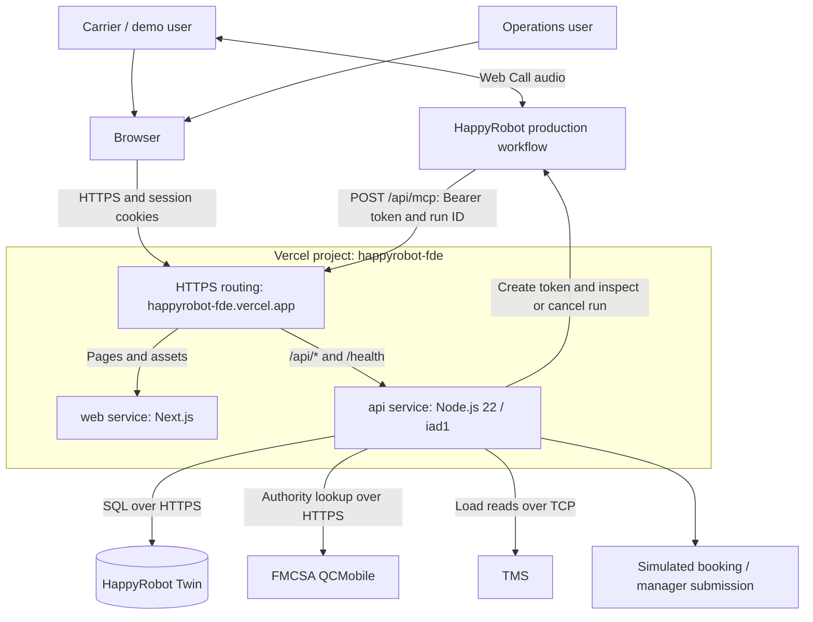
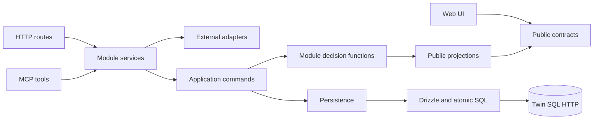
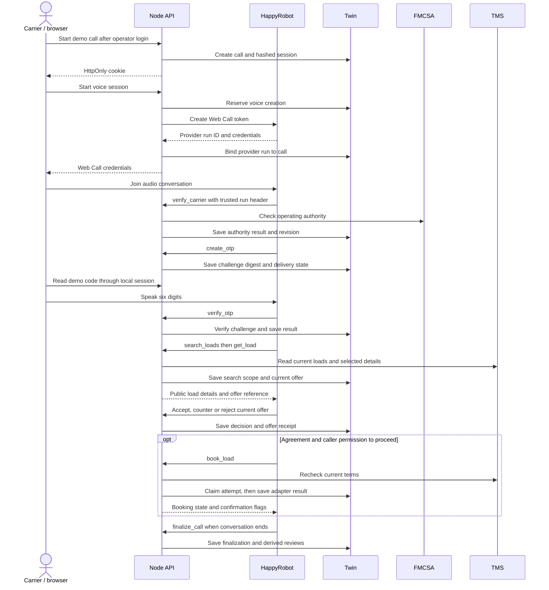
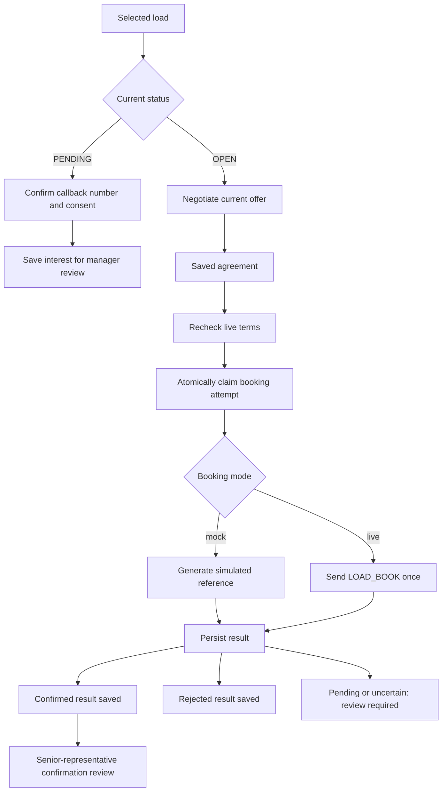
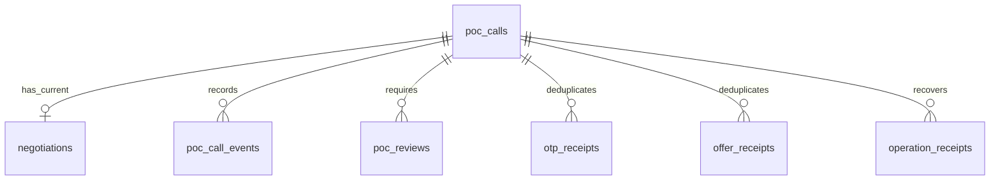
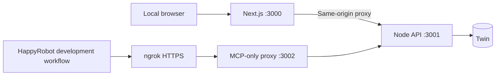

# System architecture

This POC automates inbound carrier sales: verify a carrier, discover freight,
negotiate a rate, record a booking request, and expose follow-up to operations.
HappyRobot owns the voice conversation. The Node API owns authorization and
business decisions. Twin stores the operational record independently of the
conversation transcript.

The [hosted demo](https://happyrobot-fde.vercel.app) runs as one Vercel project
with separate Next.js and Node API services. HappyRobot runs the normal agent in
its production environment; screen OTP, booking and manager submission remain
demo features. See [production operations](production.md), [local setup](local-docker.md),
and the [workflow runbook](happyrobot-agent-runbook.md) for procedures.

## System overview

Vercel routes browser API requests and HappyRobot MCP calls directly to the API
service. Hosted requests do not traverse the Next.js API proxy, ngrok or the
local MCP proxy. Audio flows directly between the browser and HappyRobot; the
API creates and binds the provider run before returning Web Call credentials.

FMCSA and TMS reads use external services. Hosted booking produces a simulated
reference without sending `LOAD_BOOK`; hosted configuration rejects live booking.

## Code organization and responsibilities

| Area | Responsibility | Entry point |
| --- | --- | --- |
| Web application | Dashboard, Web Call controls, demo verification UI | [app](../apps/web/src/app), [features](../apps/web/src/features) |
| Local browser API proxy | Used in local development; Vercel routes hosted API traffic directly | [api-proxy.ts](../apps/web/src/lib/api-proxy.ts) |
| API host | Vercel entrypoint loads the built Node server; explicit route dispatch | [server.mjs](../apps/api/server.mjs), [app.ts](../apps/api/src/app.ts) |
| HTTP and MCP transports | Validate inputs, authenticate requests, resolve sessions, filter errors | [transport](../apps/api/src/transport) |
| Application commands | Dispatch typed commands and derive reviews with state changes | [commands.ts](../apps/api/src/application/commands.ts) |
| Business modules | Calls, verification, loads, negotiation, booking and operations | [modules](../apps/api/src/modules) |
| Integrations | HappyRobot SDK, FMCSA, TCP TMS and optional OTP email webhook | [integrations](../apps/api/src/integrations) |
| Persistence | Typed snapshots, conditional commits, receipts and Twin SQL transport | [db](../apps/api/src/db) |
| Public contracts | Browser-safe Zod schemas and shared public types | [contracts](../packages/contracts/src) |
| Workflow tooling | Prompt, tool wiring, draft management and isolated evaluation controllers | [scripts/happyrobot](../scripts/happyrobot) |

Services coordinate external I/O; decision functions calculate changes against
a typed call snapshot. Persistence saves those changes and their receipts.
This is a modular API, not a set of independently deployed business services.
Some internal dependencies cross layers; the enforced boundary is between
workspaces and between business module interfaces, not a strict dependency-injection architecture.

[`check-boundaries.mjs`](../scripts/check-boundaries.mjs) prohibits web imports
from the API, API imports from Next.js/web, and cross-module imports that bypass
`index.ts`. Contracts may depend on Zod and other contract files only.
MCP input schemas live in [`toolSpecs`](../apps/api/src/transport/mcp/tools.ts);
they are also used by workflow tooling. They are distinct from browser response contracts.

## Runtime surfaces and trust boundaries

| Surface | Access and purpose |
| --- | --- |
| `GET /health` | Unauthenticated liveness; does not establish dependency readiness |
| `POST /api/local/calls` | Start/read demo call state; hosted mode requires a trusted HTTPS origin and operator session |
| `POST /api/local/carriers`, `/otp`, `/tms` | Demo controls; same access checks plus the call cookie |
| `POST /api/local/voice`, `/voice/end`, `/voice/disconnected` | Create, end or reconcile the cookie-bound voice session |
| `POST /api/mcp` | Server-to-server Bearer authentication; tool execution resolves `x-happyrobot-run-id` to a saved call |
| `POST /api/mcp/adversarial` | Local evaluation adapter with separate credentials; disabled in hosted mode |
| `GET /api/operator/auth` | Shared operator-session check; returns no private data when unauthenticated |
| `POST /api/operator/auth`, `DELETE /api/operator/auth` | Establish or clear the HttpOnly shared operator session |
| `GET /api/operator/calls`, `/api/operator/inventory` | Operator projections and live inventory; shared session plus server-side feature/configuration checks |
| `POST /api/operator/review` | Shared session, matching browser Origin, and server-side operator key |

The local cookie is opaque, HttpOnly, SameSite=Strict, scoped to `/api/local`,
and valid for one hour; it also uses Secure in production. Twin stores its SHA-256 hash. The model cannot choose
a call ID or session hash in tool arguments. The MCP server rejects browser
Origin headers and supports stateless JSON responses to POST; GET/DELETE return
405 rather than opening an SSE session.

Operator access is intentionally shared. The browser authenticates with
`OPERATOR_PASSWORD` and receives an HMAC-signed, Secure, HttpOnly session using
`OPERATOR_SESSION_SECRET`. In hosted mode its path is `/api`, protecting both
operator and browser-call routes; locally it is `/api/operator`. The separate
caller cookie selects the current call. Operator persistence additionally checks
the server-only `OPERATOR_RPC_KEY` against its registered digest in Twin.

Hosted browser requests must match `APP_PUBLIC_URL` or the current deployment's
exact `VERCEL_URL`, with matching Origin/Host. Arbitrary preview domains are not
trusted. MCP uses its own Bearer token and saved run binding, not browser cookies.
The public MCP endpoint must remain reachable without an interactive Vercel login.
This is shared demo access, not individual carrier identity or tenant isolation.

## Carrier call lifecycle

Each tool resolves the bound session again. Authority and OTP gate freight
access. Rechecking an MC number invalidates prior verification and load access;
a late upstream result cannot restore access under an old authority revision.
After TMS I/O, the API checks the revision again before releasing results.

| Tool | Business contract |
| --- | --- |
| `verify_carrier` | Save live authority evidence; rechecking resets access |
| `create_otp` | Issue/reuse a screen-delivered demo challenge; never return its digits to MCP |
| `verify_otp` | Validate exactly six caller-supplied digits; issuance and verification share the call failure budget |
| `search_loads` | Query current TMS inventory; one city is sufficient; save the latest result IDs |
| `get_load` | Require membership in the latest search; OPEN gets an offer, PENDING gets review eligibility |
| `accept_offer` | Agree to the exact current offer after caller acceptance |
| `counter_offer` | Apply the caller's requested amount against the current offer; at most three rounds per call |
| `reject_offer` | Reject the current offer without booking or automatically ending the conversation |
| `book_load` | Use the saved agreement, recheck terms, claim one attempt and return its result |
| `record_load_interest` | Save PENDING-load interest with a confirmed E.164 callback number and explicit consent |
| `finalize_call` | Save conversation outcome and optional review; creates no booking |

Pricing uses integer cents. The private ceiling remains in the API/Twin;
public results expose offered/agreed rates and opaque offer references. Offer
receipts identify already-answered offers: identical requests recover a saved
result, while conflicting reuse is rejected. Changing loads does not replenish
the three-counter budget. See [negotiation decisions](../apps/api/src/modules/negotiation/decisions.ts).

## Booking, uncertainty and human follow-up

[`bookForCall`](../apps/api/src/modules/booking/service.ts) separates preparation,
claim, external action and completion. Only the invocation that receives a new
successful claim may send a booking. A replayed claim cannot send again. If
completion persistence fails, recovery reads saved status; it never repeats the
external write. The database cannot atomically commit a TCP side effect, so
uncertainty is an explicit business state.

| Result | Meaning |
| --- | --- |
| `ok: true` | Tool returned a valid result; alone it says nothing about booking success |
| `booking_saved: true` | A confirmed adapter result was saved, including simulated results |
| `booking_confirmed: true` | Saved confirmation from the non-simulated path |
| `booking.simulated: true` | No TMS booking write occurred |
| `pending` / `uncertain` | Do not announce success or repeat the booking write; requires review |

Manager approval of a simulated booking uses a local submission adapter and
creates a stable local reference. It does not send `LOAD_BOOK`. Review closure,
manager decision and call finalization are separate facts; none proves that a
representative contacted the carrier. See [operator actions](operations.md).

A browser disconnect is also separate from conversation finalization and
provider completion. [`voice.ts`](../apps/api/src/modules/calls/voice.ts) performs
bounded provider reads after a disconnect; a missing/404 run is unconfirmed.
There is no background reconciliation worker. Final outcomes and review
projections are derived from saved facts in [application](../apps/api/src/application).

## Data model and persistence

| Table | Stored state |
| --- | --- |
| `public.poc_calls` | Session hash, authority/OTP, voice binding, latest load scope, booking JSON, interest, finalization and revision |
| `public.poc_call_events` | Ordered operational events and sanitized metadata |
| `public.poc_reviews` | One review per call/reason, resolution note and revision |
| `poc_private.negotiations` | One current negotiation per call, private pricing, offer ID and counter budget |
| `poc_private.otp_receipts` | OTP operation fingerprints and results |
| `poc_private.offer_receipts` | Answered offer fingerprints and results |
| `poc_private.operation_receipts` | Conditional commit results by call, operation and phase |
| `poc_private.operator_access` | Authorized operator-key digests; no call relationship |

TMS remains the inventory source. Twin saves call-specific IDs, statuses and
snapshots; it does not host a master load catalogue. The Drizzle definitions in
[schema](../apps/api/src/db/schema) are canonical. Despite the `twinRpc` and
`poc_*` command names, [twin-client.ts](../apps/api/src/db/twin-client.ts) is a
compatibility facade into TypeScript application commands, not remote business
stored procedures.

A mutation reads a snapshot, computes a decision, then builds one conditional
SQL batch. The batch locks the call, checks its revision and preconditions, and
writes call changes, related records and an operation receipt together. A
conflict causes a fresh read and decision, with at most four commit attempts.
An ambiguous database response triggers receipt lookup. External actions are
outside this retry loop. See [persistence.ts](../apps/api/src/db/persistence.ts)
and [atomic.ts](../apps/api/src/db/atomic.ts).

Constraints enforce rate bounds, receipt uniqueness, and a unique live booking
claim per load for pending/confirmed/uncertain attempts. Simulated bookings are
excluded from that cross-call uniqueness rule. Twin is accessed only through
its SQL HTTPS endpoint using the configured API credential; there is no runtime
Postgres connection pool. Disposable Postgres is used by database checks.

The [fresh baseline](../apps/api/db/migrations/0001_initial_schema.sql) is for a
fresh schema, not an upgrade of a populated shared workspace. Legacy SQL under
`apps/api/db/tests/fixtures/legacy` supports testing/parity, not runtime execution.

## Integrations and failure handling

| Dependency | Behavior and failure boundary |
| --- | --- |
| HappyRobot | SDK creates/binds voice runs; saved remote MCP configuration must match the local schema and trusted run header |
| FMCSA | Authority lookup failure saves an unverified result; old eligibility cannot survive a failed recheck |
| TMS reads | Validate commands/fields and require an `END`-terminated TCP response; bounded retries for retryable reads; strip private fields |
| TMS booking | Single external write after a durable claim; ambiguous results require review |
| Twin | Validate responses, reject truncation and recover receipts; retry only explicit HTTP 429 refusals, at most twice within a 10-second budget |
| OTP | MCP uses screen-only demo delivery. An optional email webhook adapter exists for the separate local OTP path; it is not wired into MCP `create_otp` |

The operator inventory scan has a 50-second total budget and reports partial
coverage explicitly. Complete scans are cached in-process for 60 seconds;
incomplete scans are not cached as complete. Instances do not share this cache.
Dashboard maps use approximate city centers, not pickup/delivery coordinates.

MCP logs record tool name, request ID, duration and safe error codes. They omit
arguments, credentials, OTPs and full upstream results. Saved events support
operator projections; they are not transcript or sentiment analysis. Public
projections deliberately omit session hashes, OTP digests and private ceilings.
The authenticated demo UI is the deliberate exception for displaying OTP digits.

## Vercel deployment

[`vercel.json`](../vercel.json) defines two services in one deployment, using
[Vercel Services](https://vercel.com/docs/services). The project is
`chalexlab/happyrobot-fde`, with `main` as its GitHub production branch.

| Component | Configuration |
| --- | --- |
| Public origin | `https://happyrobot-fde.vercel.app` |
| Web service | `apps/web`, Next.js; pages and assets |
| API service | `apps/api`, Node 22; `server.mjs` loads the built API bundle |
| Routing | `/api/*` and `/health` → API; remaining paths → web |
| Function region | US East `iad1`; this does not define external-provider data residency |
| API duration | Configured maximum 180 seconds; individual operations retain shorter deadlines |
| Persistent state | Existing Twin workspace, outside the Vercel deployment |

Both services install the root npm workspace. API credentials are read through
[`runtimeConfig()`](../apps/api/src/config/env.ts); real values belong in Vercel
environment settings. [`.env.production.example`](../.env.production.example)
documents required names, and `.vercelignore` excludes local environment files.

`NODE_ENV=production` and `HOSTED_DEMO_ENABLED=true` enable the hosted browser
flow. The runtime requires mock OTP and booking, disables adversarial MCP, and
validates the configured HTTPS origin and secrets. The HappyRobot production
connection points to `https://happyrobot-fde.vercel.app/api/mcp` and supplies
`x-happyrobot-run-id` on every tool action.

Call state, booking claims and mutation receipts survive process restarts in
Twin. In-memory caches are disposable. Local/evaluation and hosted records use
the same configured Twin workspace; deployment does not create a separate database
or migrate/reset existing data. Ambiguous network/5xx database responses are not
automatically replayed; recovery reads the operation receipt.

Vercel application releases and HappyRobot workflow publication are separate.
Rolling back the application does not restore the agent version or saved MCP
connection. Keep those versions compatible and preserve Twin state. Release,
verification and recovery commands are in [production.md](production.md).

### Local development

[Compose](../compose.yaml) remains a separate development topology:

The web and ngrok inspector bind to host loopback; API/proxy ports remain inside
Compose. Local development uses `.env.local` and `.env.docker.local`; native
controllers separately load `.env.eval.local`. Docker and ngrok are not hosted
dependencies. See [local-docker.md](local-docker.md) for lifecycle commands.

## Validation and change guide

See [testing strategy](tests.md) for Northstars, Custom Tests, adversarial
coverage and the session-controller design.

| Change | Relevant evidence |
| --- | --- |
| Public contracts or module dependencies | `npm run typecheck`, `npm run check:boundaries` |
| Business rules and transport behavior | `npm test`; focused suites under [API tests](../apps/api/tests) |
| Schema or conditional writes | `npm run db:generate`, `npm run db:check`, `npm run db:test`, `npm run db:parity` |
| Web/API packaging | `npm run build`; proxy checks under [web tests](../apps/web/tests) |
| Local connectivity and saved MCP wiring | `npm run local:check`, `npm run verify:mcp` |
| Hosted service integration | `node --env-file=.env.production.local scripts/verify-production.mjs`; see [production runbook](production.md) |
| Agent behavior | Isolated sequential native controllers; [runbook](happyrobot-agent-runbook.md) |
| Spoken call and hangup | A real microphone/audio call plus provider terminal-state evidence |

The opt-in `npm run db:verify-twin -- --allow-shared-scratch` check creates
uniquely named temporary tables; it is separate from ordinary local checks.
Native grades, sanitized backend traces and saved postconditions provide
different evidence. A passing conversation grade does not establish a booking,
and a backend smoke test does not establish audio quality. Generated evaluation
evidence belongs in ignored `tmp/evidence/`, not the maintained documentation.
