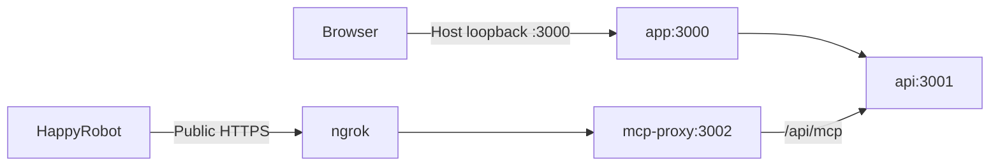

# Local Docker setup

With Docker Desktop running, configure the two ignored environment files and
start the complete development stack:

~~~sh
cp .env.example .env.local
cp .env.docker.example .env.docker.local
npm ci
npm run local:up
~~~

Open http://localhost:3000.

## Commands

~~~sh
npm run local:status   # Container status
npm run local:check    # Repeat startup and MCP checks
npm run local:logs     # Follow service logs
npm run app:stop       # Stop web and API only
npm run app:restart    # Rebuild and restart web and API
npm run local:down     # Stop the whole stack
~~~

Use one lifecycle at a time. Do not run the manual dev/proxy/tunnel commands
while the Compose stack owns ports 3000, 3002, and 4040.

## Configuration

Set the service credentials in .env.local:

- TMS_HOST, TMS_PORT, TMS_TOKEN
- FMCSA_API_KEY
- TWIN_API_KEY
- HAPPYROBOT_API_KEY and HAPPYROBOT_WORKFLOW_ID
- MCP_AUTH_TOKEN and MCP_PUBLIC_URL
- HAPPYROBOT_MCP_SERVER_NAME
- OTP_HASH_SECRET

The normal stack does not load evaluation or email overlays. Copy
`.env.eval.example` to `.env.eval.local` only for native adversarial or
negotiation controller commands. Copy `.env.email.example` to
`.env.email.local` only when explicitly testing email OTP delivery.

Set NGROK_DOMAIN and NGROK_AUTHTOKEN in .env.docker.local. The public MCP URL
must be exactly:

    https://NGROK_DOMAIN/api/mcp

Use HAPPYROBOT_ENVIRONMENT=development. Startup requires demo OTP configuration,
and Compose pins booking to mock mode. Never commit either environment file or print expanded
Compose configuration.

## Services

- app runs Next.js and binds only to loopback on the host.
- api owns credentials, business rules, integrations, and Twin access; its port
  is internal to Compose.
- mcp-proxy exposes only the normal authenticated MCP path.
- ngrok provides the public HTTPS endpoint for HappyRobot.

See [architecture](architecture.md) for runtime flows and trust boundaries.

The Compose project does not start or migrate a database. Twin must already
contain the schema required by the configured features. The fresh Drizzle
baseline must not be replayed against an existing shared workspace.

## Verification

Startup checks public MCP discovery, the saved connection, tool bindings, and
the Current > Run ID header. It does not prove microphone, audio, or complete
spoken conversation behavior.

For an explicit backend smoke test:

~~~sh
npm run verify:mcp
~~~

The smoke creates its own call and provider run, exercises authenticated
FMCSA/OTP/TMS paths, finalizes the call, and cleans up its provider run. It does
not use the operator's browser call and does not prove audio quality.

## Troubleshooting

- Missing environment files: copy both examples and fill every required key.
- Startup configuration failure: check NGROK_DOMAIN, MCP_PUBLIC_URL, the saved
  HappyRobot connection, and development environment selection.
- Port conflict: stop the other local lifecycle before running local:up.
- API or proxy unhealthy: inspect local:status and local:logs, then retry
  local:check after the app is healthy.

The local stack is a demo environment. It does not provide production
deployment, real OTP delivery, outbound callbacks, or real booking writes.
