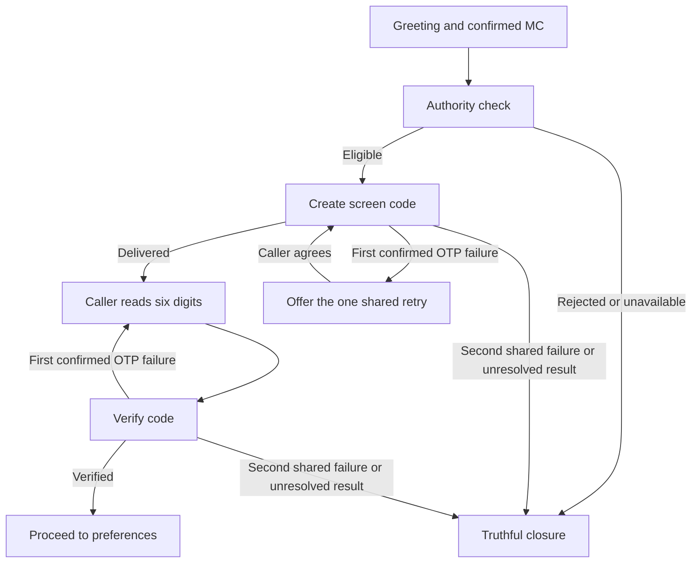

# Pre-search conversation tests

Current OTP rollout: **Version 7 is live in development**, with migration m3.6 and one shared retry. See [validation and remaining eval limitation](otp-simplification-validation.md).

22 active conversation test definitions, retaining their original PV identifiers and revised for the m3.6 shared retry policy, are saved in HappyRobot under FDE Challenge → Receive Customer Call → Adversarial Tests. They start at the greeting and stop at successful OTP verification or a truthful refusal/failure closure. They are standalone tests, not a generated suite. On 2026-09-05, the user chose adversarial tests only for now; all 21 CT custom evals were soft-deleted. The Northstars and adversarial tests were retained.

PV13 (timed code), PV15 (repeated generation), and PV18 (duplicate generation retry/decline path) were soft-deleted as unnecessary conversation cases. Their definitions and IDs remain under `retired_tests` in the local JSON; backend timing/reuse checks remain. No evals were run during this pruning update. **Evaluation execution is deferred until the user asks; binding and caller-code delivery will be fixed later.**

Generation and verification share one retry for the entire call; neither codes nor verification have an independent expiry. The second OTP failure ends the flow.

The Git-reviewable definitions, setup conditions, expected checkpoints and remote IDs are in [pre-search-paths.json](../tests/happyrobot/pre-search-paths.json).

## Coverage map

This is intended branch coverage. Saving definitions or drawing an edge does not prove that the edge has been executed.

## Historical diagnostic run (Version 5)

- Workflow: Version 5, development.
- Test: PV01, 01a071da-c592-7e87-877c-f27f62a4cb69.
- Adversarial run: 2616c3fc-539a-4484-ab84-f8ff2f02d707.
- Result: **SETUP_BLOCKED at authority check**. OTP and subsequent checkpoints were **not reached**.
- The agent greeted the caller, received MC 135797, acknowledged it and invoked the authority tool. The real backend returned VOICE_BINDING_REQUIRED. The agent requested a new demo call.
- The finalization tool also returned VOICE_BINDING_REQUIRED. The audit praised its invocation, but that is not proof that finalization was saved. No successful Twin finalization is claimed.
- Identity Accuracy failed: the initial message said Alex, whereas the prompt and Northstar expect Daniel. The live greeting was not changed by this testing task.
- The caller did not explicitly confirm a separate MC readback: the agent acknowledged the supplied digits and immediately checked authority. The judge passed MC handling. If the requirement is explicit caller confirmation, this needs a stricter checkpoint assessment; do not silently count it as observed confirmation.

## Execution gaps

The definitions are implemented and their presence in HappyRobot was verified. They are not a passing, fully runnable integration suite yet.

1. The simulator invokes actual child tools, but its run is not bound to an app/Twin call. Provide a separate bound test session per simulation without bypassing the MCP guard or reusing the active browser call.
2. Successful OTP paths require the controller to provide the actual current screen code privately to the caller actor. Never put the expected code into the sales agent's variables or tool outputs. This delivery bridge is not implemented here.
3. Elapsed-time checks, leading-zero codes, shared-retry exhaustion, unknown authority and service failures need isolated controllable state/tool conditions. Describing a fault in the caller prompt does not inject it into the backend. These scenarios explicitly declare those prerequisites and must be reported blocked/not exercised until available.
4. Northstars assess behavior; their passed/not_applicable counts are not branch-coverage assertions. Report the first failed or blocked checkpoint and mark later steps not reached.

One diagnostic was run. The remaining 24 tests were saved but not run because the same binding prerequisite would block authority/OTP coverage. No shared service fault was injected, no new workflow version was published, and no production agent configuration was changed.
