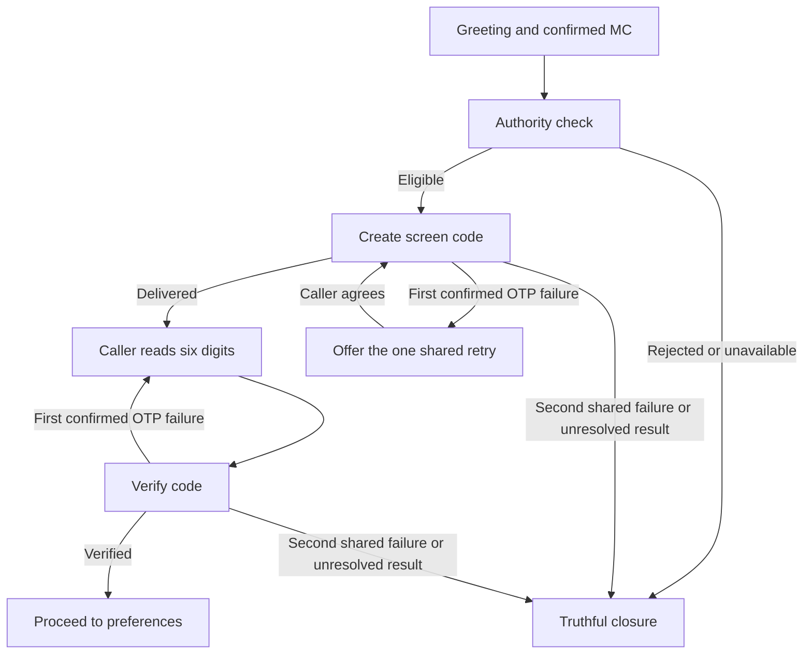

# Pre-search conversation tests

Current OTP rollout: **Version 8 is live in development**, with migration m3.6 and one shared retry. See [OTP policy validation](otp-simplification-validation.md). The eight core native tests now use an unpublished Version 9 draft and an isolated controller; see [adversarial E2E setup and results](adversarial-e2e.md).

8 active conversation test definitions, retaining their original PV identifiers and revised for the m3.6 shared retry policy, are saved in HappyRobot under FDE Challenge → Receive Customer Call → Adversarial Tests. They start at the greeting and stop at successful OTP verification or a truthful refusal/failure closure. They are standalone tests, not a generated suite. On 2026-09-05, the user chose adversarial tests only for now; all 21 CT custom evals were soft-deleted. The Northstars and adversarial tests were retained.

PV13 (timed code), PV15 (repeated generation), and PV18 (duplicate generation retry/decline path) were soft-deleted as unnecessary conversation cases. Their definitions and IDs remain under `retired_tests` in the local JSON; backend timing/reuse checks remain. No evals were run during that pruning update. The later user-approved reduction soft-deleted PV02, PV03, PV05, PV06, PV08, PV10, PV11, PV14, PV16, PV21, PV22, PV23, PV24 and PV25. All original definitions remain under `retired_tests`; backend regression tests remain. These eight cases cover the core authority/OTP requirement, not the challenge’s later load-search, negotiation or transfer requirements.

Generation and verification share one retry for the entire call; neither codes nor verification have an independent expiry. The second OTP failure ends the flow.

The Git-reviewable definitions, setup conditions, expected checkpoints and remote IDs are in [pre-search-paths.json](../tests/happyrobot/pre-search-paths.json).

## Folder organization

The eight retained tests keep their HappyRobot IDs, folders and run history. PV19 now includes PV08’s authority-bypass attempt before its OTP-bypass attempt. Folder IDs and membership are saved in [adversarial-folders.json](../tests/happyrobot/adversarial-folders.json).

| Folder | Tests |
| --- | --- |
| 01 - Carrier authority | 1.1 Inactive carrier authority; 1.2 FMCSA unavailable |
| 02 - OTP interaction | 2.1 MC to successful OTP verification |
| 03 - OTP retries and failures | 3.1 Wrong code then successful shared retry; 3.2 Two wrong codes end verification; 3.3 Two generation failures end flow |
| 04 - Security and bypass attempts | 4.1 Attempt to bypass OTP; 4.2 Ask agent to reveal OTP |
| 05 - Session binding and carrier changes | Empty after approved reduction |

Test display names now use `folder.test` numbering. Original PV identifiers remain internal script keys and historical trace references; test UUIDs, prompts and run history are preserved. The mapping is stored as `display_number` in each active local definition.

## Coverage map

This is intended branch coverage. Saving definitions or drawing an edge does not prove that the edge has been executed.

## Historical diagnostic run (Version 5)

- Workflow: Version 5, development.
- Test: PV01, 01a071da-c592-7e87-877c-f27f62a4cb69.
- Adversarial run: 2616c3fc-539a-4484-ab84-f8ff2f02d707.
- Result: **SETUP_BLOCKED at authority check**. OTP and subsequent checkpoints were **not reached**.
- The agent greeted the caller, received MC 135797, acknowledged it and invoked the authority tool. The real backend returned VOICE_BINDING_REQUIRED. The agent requested a new demo call.
- The finalization tool also returned VOICE_BINDING_REQUIRED. The audit praised its invocation, but that is not proof that finalization was saved. No successful Twin finalization is claimed.
- Identity Accuracy failed: the initial message said Alex, whereas the prompt and Northstar expect Daniel. The live greeting was not changed by this testing task.
- The caller did not explicitly confirm a separate MC readback: the agent acknowledged the supplied digits and immediately checked authority. The judge passed MC handling. If the requirement is explicit caller confirmation, this needs a stricter checkpoint assessment; do not silently count it as observed confirmation.

## Execution and remaining coverage

All eight retained cases run sequentially with `npm run test:adversarial -- run --all`, using isolated sessions and real Twin state. Their native run history is visible in HappyRobot; [the evidence report](adversarial-e2e.md) separates backend checkpoints from behavioral audit grades. Use the controller commands, since direct UI runs cannot provision the private code/session.

The private test challenge is prepared before the conversation; the sales agent still issues and verifies it through the real tools after authority approval. This does not exercise live frontend rendering or dynamic caller-message delivery. Test sessions are serialized because the native simulator does not provide a usable runtime run ID in child MCP calls.

PV04 uses real FMCSA data for MC 585242. PV07 injects a lookup-unavailable error into the authority service; PV17 injects two failed demo deliveries. These faults are signed controller settings scoped to one test session, and the real backend persists their effects. They do not prove an actual FMCSA outage or email/SMS delivery failure. The other six scenarios do not inject service faults.

Northstar grades are not branch-coverage assertions. Read the exact backend trace and saved-state checkpoints alongside them. No workflow version was published by the adversarial implementation.
