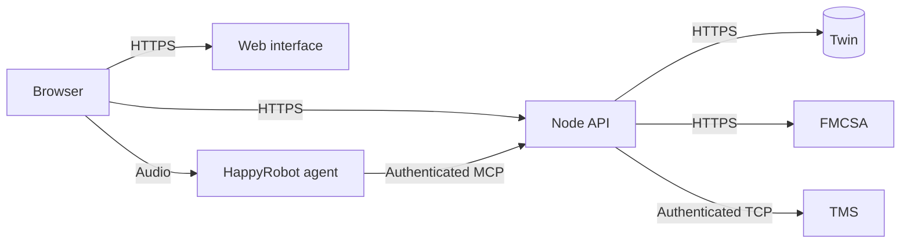

# Deployment overview

Deploying this project means hosting the web application and API, providing access
to the external services, and connecting a published HappyRobot agent to the API.
This guide describes what someone needs to prepare and the order of setup.

The application is a hosted demo: carrier verification and load searches use live
services, while OTP delivery happens on screen and booking submission is simulated.
Hosting it in production does not enable real bookings or outbound notifications.

## What you need

| Component | Purpose | What to prepare |
| --- | --- | --- |
| Vercel | Hosts the web interface and Node API | An account, a project connected to your copy of the repository, and a production branch |
| HappyRobot | Runs the voice agent and calls the application's MCP tools | Access to a US workspace, an API key, and a normal carrier-sales workflow |
| Twin | Stores calls, verification state, negotiations, bookings and reviews | A workspace with the application schema installed and operator access configured |
| FMCSA | Checks carrier operating authority | An API key |
| TMS | Supplies load inventory and pricing | A reachable TCP host and port, plus its authentication token |
| Application access | Protects the demo and the MCP endpoint | An operator password, independent signing secrets, and an MCP bearer token |
| Public HTTPS address | Connects browsers and HappyRobot to the deployed API | A stable deployment domain; a custom domain is optional |

Vercel does not provision the HappyRobot workflow, Twin database, FMCSA access or
TMS service. Those dependencies must be available separately.

## How the services connect



The browser and agent reach the same deployed API through different authenticated
routes. The API owns the external credentials and business rules; browsers do not
connect directly to Twin, FMCSA or TMS.

## Deployment sequence

### 1. Prepare the external services

Obtain the provider credentials and choose the HappyRobot workflow to deploy.
Prepare Twin with the application's database schema and an authorized operator
key. Use a separate workspace if you need separation from development or test data.

The [database documentation](architecture.md#data-model-and-persistence) explains
the schema. The fresh database baseline is intended for an empty workspace;
redeploying the application should preserve existing records.

### 2. Configure the Vercel project

Import your repository and choose its production branch. Deploy from the
repository root so Vercel can build both services defined in
[`vercel.json`](../vercel.json):

- `apps/web`: the Next.js interface.
- `apps/api`: the Node API, including MCP and external integrations.

The repository is configured for Node 22 and US East (`iad1`). API traffic is
routed to the Node service and page traffic to Next.js. Hosting only the web
folder is insufficient. The US region setting applies to Vercel execution;
external providers manage their own hosting locations.

Docker and ngrok support local development and are not required by this deployment.

### 3. Set the production configuration

Use [`.env.production.example`](../.env.production.example) as the checklist and
add the values to the Vercel project's **Production environment variables**.
The configuration covers:

- Provider credentials for HappyRobot, Twin, FMCSA and TMS.
- The public application origin and its `/api/mcp` URL.
- The HappyRobot workflow and production environment.
- Operator login, session signing, OTP signing and MCP authentication.
- Feature flags that retain screen OTP and simulated booking, with adversarial
  tooling disabled.

Generate your own secrets and keep them server-side. A local environment file
does not configure the hosted project. Preview deployments have separate settings;
reusing production credentials also reuses the associated services and data.

### 4. Build and deploy the application

Install dependencies and run the repository checks before deploying:

```sh
npm ci
npm test
npm run typecheck
npm run check:boundaries
npm run build
```

Deploy through the connected production branch or the Vercel CLI. Confirm that
both services build successfully, the public site opens, `/health` responds, and
operator login works. Check that the inventory map can retrieve real TMS loads.

### 5. Connect the production agent

Create a dedicated HappyRobot MCP connection pointing to the deployed
`/api/mcp` endpoint. Its bearer token must match the application's `MCP_AUTH_TOKEN`.
The endpoint must be reachable by HappyRobot without an interactive hosting login.

Fork a normal agent workflow, connect its tools to the production MCP connection,
and verify tool discovery, run-ID forwarding and result visibility before publishing
it in HappyRobot's production environment. The app must reference that workflow.

The [HappyRobot runbook](happyrobot-agent-runbook.md#hosted-demo-production) contains
the detailed commands. Saved HappyRobot connections are configured separately:
changing a Vercel URL or secret does not automatically update them.

### 6. Validate the complete flow

Verify more than the homepage. A successful deployment should support:

1. Operator login and a browser voice call.
2. Live carrier verification, screen OTP delivery and OTP verification.
3. Live load search and negotiation.
4. A saved simulated booking, call finalization and operator review.
5. Audio disconnect and a confirmed terminal provider run.

[`scripts/verify-production.mjs`](../scripts/verify-production.mjs) exercises the
API and service integrations using a private production environment file. It
creates demo records in the configured database. A real microphone call is still
needed to verify audio and agent hangup; automated API checks cannot establish those.

## Maintaining a deployment

For subsequent releases, run the checks, deploy the intended commit, and verify
the affected flow. A local commit alone does not update the hosted application.
Changes to environment variables require redeployment; changes to the agent or
its saved MCP connection require separate HappyRobot configuration.

Keep the application version, agent version and credentials compatible. If a
release fails, restore the last verified application deployment and, if needed,
the corresponding HappyRobot version. Preserve the database when rolling back.
