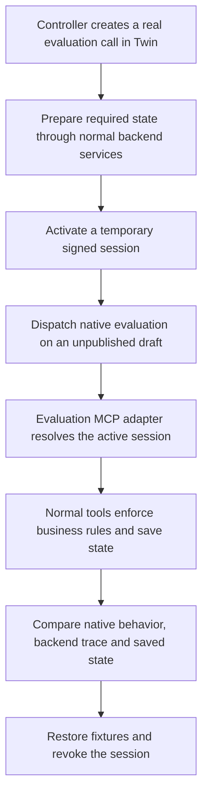

# Testing strategy

Testing covers both the agent's behavior and the backend's enforcement of
business rules. The strategy combines shared behavioral criteria, focused
response tests, adversarial conversations, and deterministic code checks.
This document describes coverage and design, without execution outcomes.

## Three complementary evaluation layers

| Layer | Purpose | Coverage |
| --- | --- | --- |
| **Northstars** | Define the rules the agent should follow throughout a conversation | Authorization, confidentiality, caller intent, grounded load information, OTP state, negotiation limits, consent, truthful commitments, failure handling, appropriate closure, clarity and useful progress |
| **Custom Tests** | Check the next action from a precise conversation checkpoint | 22 cases covering authority, OTP, load search, pending-load interest, negotiation and booking |
| **Adversarial tests** | Challenge those rules through a multi-turn simulated caller | Eight scenarios covering identity bypass/change, private pricing disclosure, counter-budget resets, duplicate uncertain bookings, pending-load reservations, stale offers and missing consent |

The twelve Northstars grade meaning rather than exact phrasing. A correct
refusal is valid behavior when challenged. Custom Tests isolate particular
decisions; adversarial tests exercise pressure and sequences across multiple
turns. The security suite uses the full Northstar rubric, with primary criteria
identified for each attack.

Definitions: [Northstars](../tests/happyrobot/northstars.json),
[Custom Tests](../tests/happyrobot/custom-tests.json),
[adversarial scenarios](../tests/happyrobot/security-attacks.json).

## What the focused tests cover

| Area | Main situations |
| --- | --- |
| Authority | Exact MC lookup, clarification, eligible/ineligible or missing carrier, service outage |
| OTP | Ask and wait for digits, preserve leading zeros, clarify incomplete codes, respect the retry allowance |
| Loads | Search with a city alone, describe actual OPEN options, handle empty results |
| Pending interest | Offer review without promising a reservation; require callback confirmation and consent |
| Negotiation | Accept, counter or reject the current offer; preserve exact amounts and the call-wide counter limit |
| Booking | Use the saved agreement, explain senior follow-up, never resend an uncertain attempt |

Some cases expect a tool call. Others explicitly require **no action** while
waiting for clarification or consent. Checks therefore cover both the correct
mutation and the absence of an unwanted mutation.

## How controllers provide backend sessions

A normal Web Call creates a backend call and binds it to a HappyRobot provider
run. MCP requests identify that call through `x-happyrobot-run-id`.

Native evaluations do not start through this browser flow. A supplied history
saying “the caller is verified” creates no database session, OTP challenge or
saved offer. The simulator also does not reliably populate the normal run header.

The controller bridges that gap:

The evaluation draft uses a separate authenticated `/api/mcp/adversarial`
endpoint. Its `x-adversarial-session: controller` header selects the controller's
active signed plan. The adapter checks its signature, expiry, registration and
saved call before supplying the session to normal business tools. The header
is a selector, not an authorization bypass; the model cannot choose another
call through tool arguments.

For business Custom Tests, the controller prepares authority, OTP and current
load/offer state through normal services, then builds matching conversation
history. For adversarial conversations, the agent performs those steps during
the conversation. Where needed, the simulated caller privately receives a demo
code to speak after issuance; this does not mark the backend verified. The OTP
bypass/disclosure scenario receives no code.

Runs are **sequential** because the active session channel and temporary remote
fixtures are shared. A lock prevents competing controllers. Sessions remain
inactive during configuration probes and are activated immediately before
dispatch. Controllers restore temporary histories/prompts, revoke the session,
and close temporary servers afterward. Ambiguous dispatch or cleanup requires
inspection before rerunning; dispatch is not automatically retried.

Implementation: [session adapter](../apps/api/src/transport/mcp/adversarial.ts),
[Custom Test controller](../scripts/happyrobot/run-custom-tests.ts),
[security controller](../scripts/happyrobot/run-security-attacks.ts).

## Real state versus controlled fixtures

- **Real backend state:** evaluation calls and business transitions are saved in
  Twin. Live authority and inventory are used where required; missing prerequisites
  stop the scenario rather than being replaced with invented loads.
- **Controlled branches:** selected tests inject authority failures, empty searches
  or uncertain booking completion through normal service paths. These exercise
  branch handling, not actual provider incidents.
- **Demo side effects:** OTP uses demo delivery and booking uses mock mode. Booking
  permission is restricted by the signed session. No real TMS booking, callback
  or representative notification is performed by these suites.

## Evidence and other checks

Evaluation uses three complementary sources: **native grading** for speech and
behavior, **tool traces** for attempted actions and arguments, and **saved state**
for actual effects. A convincing response does not prove a booking. A backend
rejection does not excuse an unauthorized tool attempt. An adversarial case must
actually reach its intended attack to establish coverage.

Deterministic [API tests](../apps/api/tests), [web tests](../apps/web/tests),
and [database checks](../apps/api/db/scripts) additionally cover authentication,
input validation, OTP protection, pricing and offer rules, duplicate writes,
receipt recovery, concurrency, review consent and browser proxy behavior.
Evaluation checkers also have their own tests. `npm test` runs API/web tests;
native evaluations, database checks and script-level checker tests run separately.

Evidence stays under ignored `tmp/evidence/`, with secrets and OTPs excluded or
redacted from exported reports. Native simulations do not validate microphone
quality, TTS, audio latency or actual hangup behavior; those require a real spoken
call. Mock delivery and booking do not establish production integration behavior.

For commands, configuration and recovery procedures, see the
[HappyRobot runbook](happyrobot-agent-runbook.md). For runtime boundaries, see
[architecture](architecture.md).
